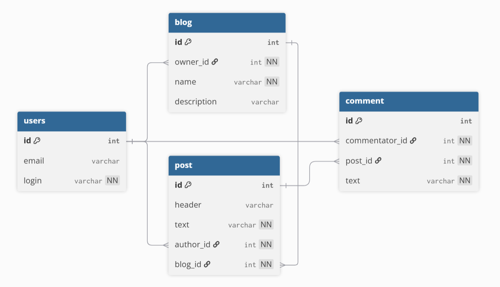

## Решение тестового задания Farpost
Направление: Python-разработка\
Автор: Янович Яков

---
В задаче есть __неточность__: в authors_database (db1) недостаточно информации для составления датасета comments\
__Исправление__: в базу добавлена дополнительная таблица сomment





### О решении
Настроены 3 docker compose сервиса:
- db - PostgreSQL
- api - FastAPI
- tests - автоматический запуск тестов api

Перед запуском можно добавить файл `.env` с логином и паролем к базе данных и портом приложения (делать это не обязательно - настроены значения по умолчанию для удобства проверяющего)

Запуск проекта возможен командой:
```shell
docker compose up --build
```
_(режим разработчика - hot reload приложения при изменении файлов)_\
__или__
```shell
docker compose -f docker-compose.yaml up --build
```
_(режим "продакшена")_

Требуемые в задаче эдпоинты по умолчанию доступны по адресам:
```
localhost:8000/api/comments
```
```
localhost:8000/api/general
```

Дополнительно создана небольшая веб-страница для наглядной демонстрации работы системы.\
Страница доступна по адресу
```
localhost:8000/web
```

---
Также вы можете посмотреть мое предыдущее решение этого тестового задания (от 2024 года):
[github.com/ReSpix/test_task_farpost](https://github.com/ReSpix/test_task_farpost). Надеюсь сравнение покажет рост моих навыков за это время